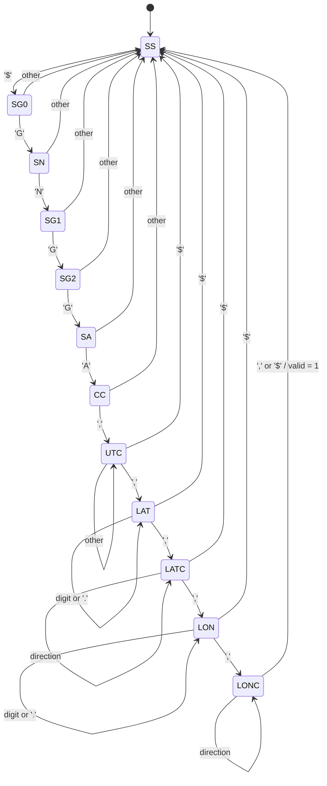

# HW02 UART GPS

This application receives GPS data through the S32K312 LPUART6 peripheral and
prints the parsed latitude and longitude through the same UART.

## Runtime flow

1. `main()` initializes LPUART6 at `9600` baud with `UART6_Init(9600)`.
2. The GPS parser data structure is initialized with `GPS_parser_init()`.
3. The application prints `UART OK` to indicate that startup is complete.
4. The LPUART6 receive interrupt reads each incoming byte and pushes it into
	the 128-byte `ringBuffer_t` receive buffer.
5. The foreground loop calls `GPS_ProcessRx()`, which removes all pending bytes
	from the ring buffer and passes them one at a time to `GPS_parser()`.
6. When a complete supported sentence has been received, `GPS_parser()` marks
	the GPS data as valid.
7. `GPS_PrintData()` prints the coordinates and clears the parsed values so the
	same result is not printed again.

The application continues this foreground processing loop indefinitely. UART
reception is interrupt-driven, while parsing and printing are performed in the
main loop.

## Supported sentence

The parser recognizes the GNGGA sentence structure shown below:

```text
$GNGGA,221056.000,2043.70259,N,10325.56150,W,1,11,1.1,1610.4,M,0.0,M,,*5E
```

The parser extracts:

- latitude: `2043.70259`, followed by its direction (`N` or `S`)
- longitude: `10325.56150`, followed by its direction (`E` or `W`)

Latitude and longitude are stored internally as scaled unsigned integers. For
example, `2043.70259` is stored as `204370259`.

The current parser uses the sentence structure to identify valid data. It does
not validate the hexadecimal checksum or store the remaining GGA fields such as
fix quality, satellite count, altitude, or time.

## Parser state machine

`GPS_parser()` processes one byte at a time. The `currentState` variable keeps
the parser positioned within the expected GNGGA sentence. The parser starts in
`SS` and waits for the `$` start marker.

| State | Expected input or action | Next state | Data handled |
| --- | --- | --- | --- |
| `SS` | `$` | `SG0` | Start of a new sentence |
| `SG0` | `G` | `SN` | First character of `GNGGA` |
| `SN` | `N` | `SG1` | Second character of `GNGGA` |
| `SG1` | `G` | `SG2` | Third character of `GNGGA` |
| `SG2` | `G` | `SA` | Fourth character of `GNGGA` |
| `SA` | `A` | `CC` | Final character of `GNGGA` |
| `CC` | `,` | `UTC` | Separator after the message type |
| `UTC` | `,` | `LAT` | Skip the UTC time field |
| `LAT` | digits and `.` | `LAT` | Accumulate latitude |
| `LAT` | `,` | `LATC` | End of latitude |
| `LATC` | direction, such as `N` | `LATC` | Store latitude direction |
| `LATC` | `,` | `LON` | End of latitude direction |
| `LON` | digits and `.` | `LON` | Accumulate longitude |
| `LON` | `,` | `LONC` | End of longitude |
| `LONC` | direction, such as `W` | `LONC` | Store longitude direction |
| `LONC` | `,` or `$` | `SS` | Mark GPS data valid |

An unexpected character in the message-type states returns the parser to
`SS`, allowing it to search for the next `$`. A `$` received while processing
the UTC, latitude, latitude-direction, or longitude fields also starts a new
search. Characters in the UTC field are otherwise ignored. Once the longitude
direction is followed by a comma, the parser marks the data valid without
processing the remaining GGA fields.



## Main components

- `main.c` initializes the peripherals and runs the foreground processing loop.
- `hal/UART.c` configures the S32K312 LPUART6 peripheral and handles RX
  interrupts.
- `components/ring_buffer` provides the byte receive FIFO.
- `components/nmea_gps` contains the GNGGA parser and coordinate output.
